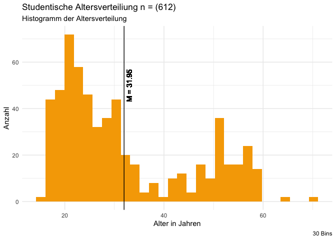

    library(tidyverse)

    ## ── Attaching core tidyverse packages ──────────────────────── tidyverse 2.0.0 ──
    ## ✔ dplyr     1.1.4     ✔ readr     2.1.5
    ## ✔ forcats   1.0.0     ✔ stringr   1.5.1
    ## ✔ ggplot2   3.5.1     ✔ tibble    3.2.1
    ## ✔ lubridate 1.9.3     ✔ tidyr     1.3.1
    ## ✔ purrr     1.0.2     
    ## ── Conflicts ────────────────────────────────────────── tidyverse_conflicts() ──
    ## ✖ dplyr::filter() masks stats::filter()
    ## ✖ dplyr::lag()    masks stats::lag()
    ## ℹ Use the conflicted package (<http://conflicted.r-lib.org/>) to force all conflicts to become errors

    library(ggthemes)
    library(AachenColorPalette)

    df <- readRDS("data/data.rds")

# Teammitglieder

-   JRH
-   PMB

# Forschungsfrage

“Wie ist die Aktzeptanz von gelber Tapete?”

# Faktorenraum

Hier wird später ein Bild eingebunden.

    ggplot(df) +
      aes(x = Age) +
      geom_histogram(bins = 30L, fill = aachen_color("orange")) +
      geom_vline(xintercept = mean(df$Age, na.rm = TRUE)) +
      geom_text(x = mean(df$Age, na.rm = TRUE), y = 50, label = paste0("M = ", round(mean(df$Age, na.rm = TRUE), 2)), angle = 90 , vjust = 1.5) +
      labs(x = "Alter in Jahren", 
           y = "Anzahl", 
           title = paste0("Studentische Altersverteiliung n = (", nrow(df), ")"), 
           subtitle = "Histogramm der Altersverteilung", 
           caption = "30 Bins") +
      theme_minimal()

    ## Warning: Removed 18 rows containing non-finite outside the scale range
    ## (`stat_bin()`).

