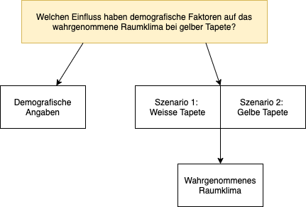

# Einfluss von gelber Tapete

## Teammitglieder

-   JRH
-   DPB

# Forschungsfrage

Was sind Einflussfaktoren auf die Akzeptanz von **gelber** Tapete?

## Faktorenraum

<figure>

<figcaption aria-hidden="true">Faktorenraum</figcaption>
</figure>

    library(tidyverse)

    ## ── Attaching core tidyverse packages ──────────────────────── tidyverse 2.0.0 ──
    ## ✔ dplyr     1.1.3     ✔ readr     2.1.4
    ## ✔ forcats   1.0.0     ✔ stringr   1.5.0
    ## ✔ ggplot2   3.4.4     ✔ tibble    3.2.1
    ## ✔ lubridate 1.9.3     ✔ tidyr     1.3.0
    ## ✔ purrr     1.0.2     
    ## ── Conflicts ────────────────────────────────────────── tidyverse_conflicts() ──
    ## ✖ dplyr::filter() masks stats::filter()
    ## ✖ dplyr::lag()    masks stats::lag()
    ## ℹ Use the conflicted package (<http://conflicted.r-lib.org/>) to force all conflicts to become errors

    df <- dataforsocialscience::robo_care

    df.short <- df[,c(1:3,28:29)]
    names(df.short)[4] <- "heidi"
    names(df.short)[5] <- "tom"

    df.short %>% 
      filter(job_type == "employee" | job_type == "student") %>% 
      filter(gender != "rather not say") %>% 
      droplevels() -> df.short

    df.short$agegroup <- cut(df.short$age, labels = c("jung", "alt"),
                             breaks = c(-Inf, median(df.short$age),Inf))

    jmv::mancova(df.short, 
                 deps = c("heidi", "tom"), 
                 factors = c("gender", "job_type", "agegroup"), multivar = "wilks")

    ## 
    ##  MANCOVA
    ## 
    ##  Multivariate Tests                                                                                    
    ##  ───────────────────────────────────────────────────────────────────────────────────────────────────── 
    ##                                                 value        F              df1    df2    p            
    ##  ───────────────────────────────────────────────────────────────────────────────────────────────────── 
    ##    gender                      Wilks' Lambda    0.8318566    24.86202601      2    246    < .0000001   
    ##    job_type                    Wilks' Lambda    0.9495862     6.53010219      2    246     0.0017248   
    ##    agegroup                    Wilks' Lambda    0.9993340     0.08197472      2    246     0.9213204   
    ##    gender:job_type             Wilks' Lambda    0.9727673     3.44339658      2    246     0.0335044   
    ##    gender:agegroup             Wilks' Lambda    0.9882212     1.46606632      2    246     0.2328414   
    ##    job_type:agegroup           Wilks' Lambda    0.9911917     1.09304522      2    246     0.3368165   
    ##    gender:job_type:agegroup    Wilks' Lambda    0.9984623     0.18942377      2    246     0.8275564   
    ##  ───────────────────────────────────────────────────────────────────────────────────────────────────── 
    ## 
    ## 
    ##  Univariate Tests                                                                                                          
    ##  ───────────────────────────────────────────────────────────────────────────────────────────────────────────────────────── 
    ##                                Dependent Variable    Sum of Squares    df     Mean Square     F               p            
    ##  ───────────────────────────────────────────────────────────────────────────────────────────────────────────────────────── 
    ##    gender                      heidi                   40.756192759      1    40.756192759    49.534211670    < .0000001   
    ##                                tom                      5.114315740      1     5.114315740    15.270556014     0.0001203   
    ##    job_type                    heidi                    8.748276346      1     8.748276346    10.632469397     0.0012677   
    ##                                tom                      2.894520439      1     2.894520439     8.642590474     0.0035953   
    ##    agegroup                    heidi                    0.103010622      1     0.103010622     0.125196924     0.7237668   
    ##                                tom                      0.039468836      1     0.039468836     0.117847840     0.7316725   
    ##    gender:job_type             heidi                    0.537199726      1     0.537199726     0.652901145     0.4198549   
    ##                                tom                      1.101832512      1     1.101832512     3.289901514     0.0709207   
    ##    gender:agegroup             heidi                    0.663963037      1     0.663963037     0.806966583     0.3698934   
    ##                                tom                      0.245556038      1     0.245556038     0.733192362     0.3926803   
    ##    job_type:agegroup           heidi                    0.817880666      1     0.817880666     0.994034803     0.3197339   
    ##                                tom                      0.693285053      1     0.693285053     2.070041972     0.1514833   
    ##    gender:job_type:agegroup    heidi                    0.002863102      1     0.002863102     0.003479753     0.9530082   
    ##                                tom                      0.087598621      1     0.087598621     0.261555939     0.6095101   
    ##    Residuals                   heidi                  203.228824526    247     0.822788763                                 
    ##                                tom                     82.723640625    247     0.334913525                                 
    ##  ─────────────────────────────────────────────────────────────────────────────────────────────────────────────────────────
